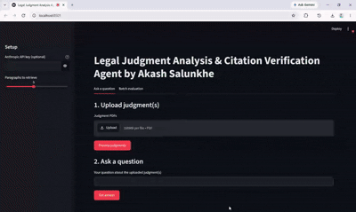

# Legal Judgment Analysis & Citation Verification Agent

A small AI workflow that answers questions about a court judgment using only the
text of that judgment, shows which paragraph the answer came from, and then checks
whether that paragraph actually supports the answer (instead of trusting the model
blindly).

Built for the Brainwonders AI Intern assignment (LegalTech track).

## Overview

The user uploads one or more judgment PDFs and asks a question. The system:

1. Extracts and paragraph-numbers the judgment text
2. Retrieves the paragraphs most relevant to the question
3. Asks an LLM to answer using only those paragraphs, and to cite which paragraph(s) it used
4. Separately checks whether the cited paragraph actually supports the answer, and scores it

If the evidence doesn't support an answer, the system is instructed to say so rather
than invent one.

## Architecture / workflow nodes

| # | Node | File | What it does |
|---|------|------|---------------|
| 1 | Judgment Input | `app.py` | Streamlit file uploader takes judgment PDF(s) |
| 2 | Document Processing | `document_processing.py` | Extracts text (OCR fallback for scanned PDFs), splits into numbered paragraphs |
| 3 | Retrieval | `retrieval.py` | TF-IDF + cosine similarity, returns top-k paragraphs for a question |
| 4 | LLM Answer | `llm_nodes.py` -> `generate_answer()` | Claude answers using only the retrieved paragraphs, labels the answer as directly stated / inferred / unsupported |
| 5 | Citation Extraction | `llm_nodes.py` -> `generate_answer()` | Same call returns which judgment + paragraph the answer is based on |
| 6 | Citation Verification / Evaluation | `llm_nodes.py` -> `verify_and_evaluate()` | Separate LLM call: given only the answer + the cited paragraph (not the original context), judges Supported / Partially Supported / Unsupported, flags hallucination, scores relevance/accuracy |
| 7 | Output | `app.py` | Renders answer, citations, evidence, verification result and scores |

Generation (node 4/5) and verification (node 6) are deliberately two separate LLM
calls, as the brief asks for - the verification call is not shown the full evidence
set, only the specific paragraph being checked, so it can't just rubber-stamp
whatever the generation step cited.

## Setup

```bash
pip install -r requirements.txt
```

OCR (for scanned PDFs) needs two system binaries. On Debian/Ubuntu:

```bash
sudo apt-get install tesseract-ocr poppler-utils
```

(`packages.txt` in this repo installs the same two automatically on Streamlit
Community Cloud.)

Set your Anthropic API key:

```bash
export ANTHROPIC_API_KEY=sk-ant-...
```

You can also paste the key into the sidebar of the running app instead.

**Without an API key** the app still runs, but `llm_nodes.py` falls back to a naive
mock (extractive answer + word-overlap check) just so the UI doesn't break. This is
only useful for testing the pipeline plumbing.

## Running

```bash
streamlit run app.py
```

Two tabs:
- **Ask a question** - upload judgment PDF(s), then ask a question interactively
- **Batch evaluation** - upload a JSON file of `{question, expected_answer}` pairs and run all of them at once

To regenerate the committed sample artefacts from the command line:

```bash
python evaluate.py
```

This reads `sample_data/judgment_1.pdf` and `sample_data/judgment_2.pdf` (the two
sample judgments from the assignment) plus `sample_data/eval_questions.json`, and
writes `outputs/sample_qna_output.json` and `outputs/evaluation_report.md`.




What the demo shows:

- Uploading one or more judgment PDFs
- Retrieving relevant paragraphs
- Generating an evidence-grounded answer
- Showing the judgment and paragraph citation
- Independently verifying the citation
- Displaying evaluation scores and hallucination status


## Models, APIs, tools

- **LLM**: Anthropic Claude (`claude-sonnet-4-6` by default, set `CLAUDE_MODEL` to change)
- **Retrieval**: scikit-learn TF-IDF + cosine similarity (no vector DB - the judgment
  set for this POC is small enough that this is fast and good enough; would swap for
  embeddings + a vector store for a larger corpus)
- **PDF/OCR**: pdfplumber for text-layer PDFs, pytesseract + pdf2image for scanned PDFs
- **UI**: Streamlit

## Prompting approach

Both LLM calls are instructed to answer only from the given evidence and to return
strict JSON (parsed directly, no free text). The generation prompt asks the model to
label its own answer as `directly_stated`, `inferred`, or `unsupported`, and to
abstain rather than guess when evidence is thin. The verification prompt is only
given the answer and the single cited paragraph - not the original question context
or the other retrieved paragraphs - so it's checking the citation on its own merits
rather than agreeing with itself.

## Evaluation methodology

`evaluate.py` runs a fixed set of questions (in `sample_data/eval_questions.json`,
each with a human-written expected answer) through the full pipeline and records,
per question: the generated answer, citation, citation verification result,
hallucination flag, evidence relevance score, answer accuracy score, and overall
score. `outputs/evaluation_report.md` summarises these as a table with an average
score across the set.

## Sample input / output

Sample judgments used: *Jaipur Mineral Development Syndicate v. CIT* (1977) and
*Vasudev Dhanjibhai Modi v. Rajabhai Abdul Rehman* (1970), both supplied with the
assignment. Example from `outputs/sample_qna_output.json`:

```json
{
  "question": "Can an executing court go behind a decree and question its validity on facts?",
  "citations": [{"judgment": "Vasudev_Modi_v_Rajabhai", "paragraph": "6"}],
  "citation_verification": "Supported",
  "hallucination_flag": false,
  "overall_evaluation_score": 98
}
```

Full run: see `outputs/sample_qna_output.json` and `outputs/evaluation_report.md`.

## Known limitations / assumptions

- The two sample judgment PDFs are scanned SCC Online exports with no real text
  layer (only a repeating watermark/footer is selectable text), so answers depend on
  Tesseract OCR quality. OCR introduces occasional character errors (e.g. names like
  "Ispahani" / "Iyer" sometimes come out slightly garbled) - fine for a POC, not
  something you'd ship as-is for production legal research.
- Paragraph numbering is detected with a regex on numbered-paragraph markers
  (`4. ...`, `5. ...`). If a single PDF contains more than one case concatenated
  together (as `judgment_1.pdf` does - the tail of one case, a full case, and the
  start of another), paragraph numbers restart and can collide across cases. One
  judgment per PDF avoids this.
- Retrieval is TF-IDF, which is keyword-based - it will miss a relevant paragraph
  that's phrased very differently from the question. Fine at this scale; a real
  deployment with many judgments would want embeddings.
- Citation verification is a second LLM call, not a rule-based/programmatic check -
  it's a much stronger check than trusting the generation step's own citation, but
  it's still a model judgment, not a guarantee.
- This is a proof-of-concept, per the brief - it hasn't been tested on a wide range
  of judgment formats, and error handling (malformed PDFs, empty uploads, API
  failures) is minimal.

## Bonus items implemented

- Confidence-style classification (Supported / Partially Supported / Unsupported)
- Hallucination / unsupported-content flag
- Batch evaluation mode with an average score across a question set
- Simple UI (Streamlit)

Not implemented: hybrid retrieval, contradiction detection, multi-judgment
comparison (retrieval does pool paragraphs across all uploaded judgments, but there's
no explicit "these two judgments disagree" step).
